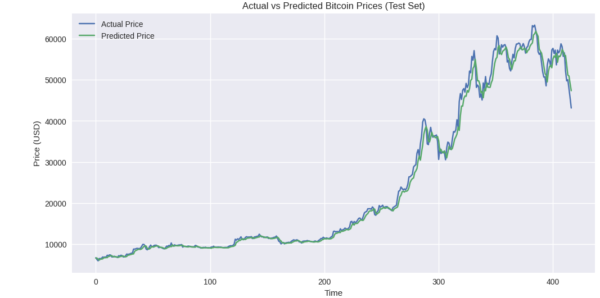

# BitForecast: Neural Network-Based Price Prediction

##  Project Overview
**BitForecast** is a deep learning–based project designed to forecast Bitcoin prices using neural networks trained on historical market data. The project aims to capture nonlinear price patterns and provide meaningful insights for cryptocurrency price prediction using data-driven techniques.

---

##  Model Used
- Feedforward Neural Network (FNN)
- Fully connected dense layers
- ReLU activation for hidden layers
- Linear activation for regression output

The model learns complex nonlinear relationships between past Bitcoin prices and future price movements.

---

##  Dataset
- **Source:** Kaggle (Bitcoin historical price dataset)
- **Data Type:** Time-series market data
- **Target Variable:** Bitcoin closing price

Only historical price information is used for training and prediction.

---

## ⚙️ Project Workflow
1. Data loading and preprocessing  
2. Feature engineering and normalization  
3. Train–validation–test split  
4. Neural network model development  
5. Model training and optimization  
6. Price prediction and evaluation  

---

##  Results
The model demonstrates strong predictive performance in forecasting Bitcoin prices on unseen test data. The figure below compares the **actual vs predicted Bitcoin closing prices**, highlighting how closely the model’s predictions follow real market movements.

###  Actual vs Predicted Bitcoin Prices

---

##  Evaluation Metrics
The model is evaluated using standard regression metrics:
- Mean Absolute Error (MAE)
- Root Mean Squared Error (RMSE)
- R² Score

These metrics help assess prediction accuracy and overall model performance.

---

##  Future Improvements
- Implement LSTM / GRU models for advanced time-series forecasting
- Add technical indicators such as RSI and MACD
- Integrate sentiment analysis from news or social media
- Extend the model for multi-day price forecasting

---

##  Technologies Used
- Python
- NumPy
- Pandas
- TensorFlow / Keras
- Matplotlib
- Scikit-learn

---

## 👤 Author
**Om Patil**  
MSc Data Science, AI & Digital Business
